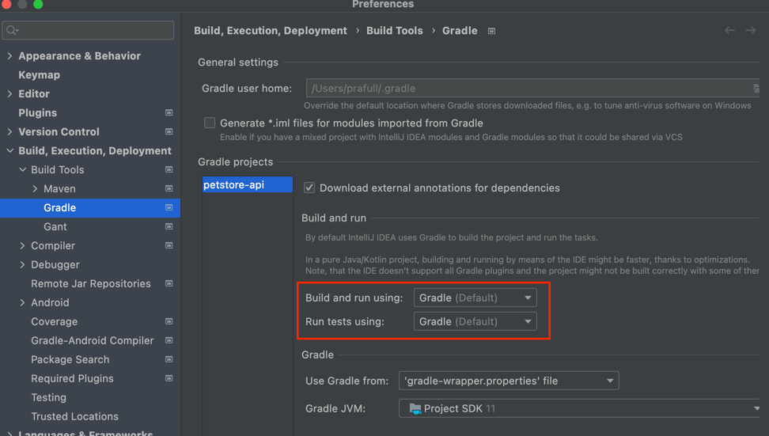
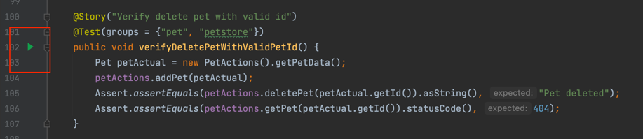

# *RESTful API automation framework*

### Overview
This is the REST API test automation framework for `petstore` REST APIs.<br/> 
Framework allows us to add, execute the test cases for different `petstore` REST APIs mentioned [here](https://petstore3.swagger.io/) and verify the results using `Allure report` and `Execution logs`

### Tech stack, libraries 
- [TestNG](https://testng.org/doc/) Testing framework `Easy to structure tests, provides grouping of tests and assertions`
- [RestAssured](https://rest-assured.io/) REST API automation framework `Powerful Java based API Test framework, simple to write API tests`
- [Java](https://openjdk.org/projects/jdk/11/) Programming language
- [Lombok](https://projectlombok.org/) `Used to generate getters, setters, builder pattern for Data Models`
- [Gradle](https://gradle.org/) Build tool `faster build tool`
- [Allure](https://docs.qameta.io/allure/) Test reporting tool `Lightweight, easy to integrate, provides annotations, user friendly report dashboards`
- [Log4j2](https://logging.apache.org/log4j/2.x/index.html) Logging `Simple, customizable options for logging`
- [IntelliJ](https://www.jetbrains.com/idea/) as the IDE

### Pre-requisites
- Install allure using command 
  - MacOS ``brew install allure``
  - Windows ``scoop install allure`` [Scoop](https://scoop.sh/)
- Download [IntelliJ](https://www.jetbrains.com/idea/download) and setup lombok, refer [here](https://projectlombok.org/setup/intellij)
- Java
  - MacOS, use command `brew install openjdk@11`
  - Windows [Download](https://www.oracle.com/in/java/technologies/javase/jdk11-archive-downloads.html)

### Project structure

##### Refer below project structure to understand the different components of framework 
```shell
- petstore-api
   - src
     -main
       -java
         -com
           -petstore-api
               -actions
                  - Classes with API methods POST, GET, DELETE etc
               -base
                  - Classes which has re-usable entities
               -listeners
                  - Test Listener for logging purpose
               -models
                  - Data models for Pet, Store, User
               - [Configs.java] (Contains API EndPoints)
       -resources
           - Contains config_endpoints.properties, log4j2.xml, petImage   
     -test
       -java
         -com
           -petstore-api
               -tests
                 - Classes with all tests
       -resources
         - [testng.xml]
  -build.gradle
  -gradle.properties
  -.gitignore
```

### Getting started
 
#### 1. Open the [project](https://github.com/prafull27/petstore-api) in the IntelliJ IDE
#### 2. Once all the dependencies are in sync, we can run the automated tests using below commands, from the root directory of project:
 1. To run only PET APIs, provide command line parameter `-PGROUP` as `pet`, as below
   ```shell script
       $ ./gradlew clean build -PGROUP=pet
   ```
 2. Similarly, to run STORE or USER tests, provide the command line parameter accordingly
   ```shell script
       $ ./gradlew clean build -PGROUP=<store/user>
   ```
 3. To run all petstore tests, run below command. This will take default test group from `gradle.properties` (currently, set as `petstore`) 
   ```shell script
       $ ./gradlew clean build
   ```
 4. Running a specific test using `Run` option from `IntilliJ`. 
    1. Under `Gradle settings`, make sure `Run tests using` is set to default value `Gradle` 
    
    

    2. Go to test which needs to be run and click on Play icon
    
    

#### 3. Once execution is completed, `Allure report` would be available at `./allure-report/index.html`
#### 4. `Execution logs` would be available at `./build/logs/petstore-api.log`

